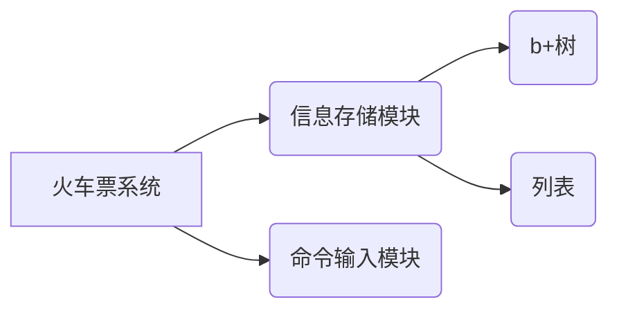

# **火车票系统开发文档** By hiweibolu

## **模块划分图**



## **信息存储模块**

用于将各种信息保存至外存的模块。

用于保存信息的文件结构有两种，一种是基于B+树的索引结构，另一种是比较朴素的有序列表。

### **b+树**

用于快速检索符合条件的信息。

支持的操作有：

 - **单点插入**：将一对key值和value值插入b+树中；如果这个key值已经存在，那么就将原value值替换为新value值。

 - **单点查询**：查询指定的key值对应的value值，如果不存在这个key值，则返回0。

 - **区间查询**：查询指定的key值区间的value值，记录在一个数组中。

 - **清空**。

相关类：<a href='#node'>node</a>, <a href='#btree'>btree</a>.

### **列表**

顺序存储信息，本身一般不具备索引。配合b+树使用，通过b+树索引在列表中的位置，实现存储大块的数据。

支持的操作有：

 - **尾端插入**：将任意类型的数据插入至尾端，返回索引。

 - **取值**：通过索引，在指定位置获取任意类型的数据。

 - **修改**：通过索引，在指定位置写入覆盖任意类型的数据。

 - **清空**。

相关类：<a href='#mylist'>mylist</a>.


## **命令输入模块**

包含多个系统。

 - 对于输入的命令字符串，分解成可供程序识别程度的解释系统。

 - 将输入的日期或时间转化成以分钟为单位的整型，或者将整型输出成日期+时间的格式的时间系统。

 - 计算字符串的哈希值的哈希系统。

### **解释系统**

对于输入的命令字符串，分解成可供程序识别的程度。

对于输入的命令字符串，先过滤开头的空格。

然后将字符串与每种命令名称逐一比较，匹配成功之后，调用以命令名称为名的函数。

最后，使用explainer类处理参数，方便函数使用。

相关类：<a href='#explainer'>explainer</a>.

### **时间系统**

将输入的日期或时间转化成以分钟为单位的整型，或者将整型输出成日期+时间的格式。

相关函数：<a href='#date2day'>date2day</a>, <a href='#date2minute'>date2minute</a>, <a href='#printTime'>printTime</a>.

### **哈希系统**

计算字符串的哈希值。

采用双哈希算法。

相关函数：<a href='#myHash'>myHash</a>.


## **用户管理模块**

管理用户信息，管理用户登录状态。

实现添加用户(add_user)，登录(login)，登出(logout)，查询用户信息(query_profile)，修改用户信息(modify_profile)命令。

使用列表：
 - `users.txt` 以类型user来存储用户的数据。

使用b+树：
 - `userb.txt` 以用户username的哈希值为key值，value值为用户在`users.txt`存储数据的索引。
 - `loginb.txt` 以用户username的哈希值为key值，value值为用户是否登录，1为是，0为否。

相关类：<a href='#user'>user</a>.

相关函数：<a href='#add_user'>add_user</a>, <a href='#login'>login</a>, <a href='#logout'>logout</a>, <a href='#query_profile'>query_profile</a>, <a href='#modify_profile'>modify_profile</a>.

## **车次管理模块**

管理车次信息，并能对其有一定的查询功能。

实现添加车次(add_train)，发布车次(release_train)，查询车次信息(query_train)，删除(delete_train)，查询车票(query_ticket)，查询换乘(query_transfer)命令。

使用列表：
 - `trains.txt` 以类型train来存储车次的数据。
 - `ttrains.txt` 以类型train来存储某天车次的数据。

使用b+树：
 - `trainb.txt` 以车次trainID的哈希值为key值，value值为车次在`trains.txt`存储数据的索引。
 - `ttrainb.txt` 以车次日期+车次trainID的哈希值为组合key值，value值为这天车次在`ttrains.txt`存储数据的索引。
 - `stationb.txt` 以车站名字的哈希值为key值，value值为经过此车站的车次trainID哈希值。

相关类：<a href='#train'>train</a>.

相关函数：<a href='#add_train'>add_train</a>, <a href='#release_train'>release_train</a>, <a href='#query_train'>query_train</a>, <a href='#delete_train'>delete_train</a>, <a href='#query_ticket'>query_ticket</a>, <a href='#query_transfer'>query_transfer</a>.


## **订单管理模块**

管理订单信息，实现候补购票，退票功能，并且在退票后检测并尝试完成候补订单。

实现购票(buy_ticket)，查询用户订单(query_order)，退票(refund_ticket)命令。

使用列表：
 - `orders.txt` 以类型order来存储订单的数据。

相关类：<a href='#order'>order</a>.

相关函数：<a href='#buy_ticket'>buy_ticket</a>, <a href='#query_order'>query_order</a>, <a href='#refund_ticket'>refund_ticket</a>.


## **Reference**

### **约定**


```
typedef unsigned long word;
typedef unsigned long long dword;
```


### **类**

#### <a name='node'>**node**</a>

b+树中使用的结点类型。

每个结点有至多M个儿子。

##### 成员变量

|变量名|定义|描述|
|----|----|----|
|key|`dword key[M];`|结点存储的key值，或者是对应儿子中最大的key值。按照从小到大排序。|
|son|`dword son[M];`|结点的儿子在b+树中的索引；如果结点是叶子结点，则是value值。|
|num|`dword num;`|结点当前的儿子的数量，相当于`key`和`son`的大小。|
|isLeaf|`dword isLeaf;`|结点是叶子结点时为1，否则为0。|
|next|`dword next;`|结点是叶子结点时才有值，值为下一个叶子结点在b+树中的索引。|

##### 成员函数

###### **search**

```
int search(dword x);
```

查询大于等于x的key值在数组中的最小下标。

二分查找。

###### **add**

```
int add(dword x, dword y = 0);
```

加入一对key值和value值，维护key值升序。暴力实现。

返回加入后的下标。

###### **top**

```
dword top();
```

返回最大的key值，即`key[num - 1]`。

* * *

#### <a name='btree'>**btree**</a>

b+树。构造时需要传入文件名，此时读取或者是创建该文件。

文件头保留一个dword，存储b+树的根的索引。

b+树起始时拥有一个key值无穷大的结点，是最初的根。

##### 成员变量

|变量名|定义|描述|
|----|----|----|
|filename|`char filename[20];`|b+树所用的文件名。|
|fstream|`fstream fs;`|用于读写的文件流。|

##### 成员函数

###### **query**

```
void query(dword x, dword* buffer, int &cnt);
```

获取指定区间的key值的value值数组；结果储存到buffer数组中，cnt记录个数。

利用`node::search(x)`来二分查找快速定位。

定位完毕之后沿着`next`检索即可。

###### **search**

```
dword search(dword x);
```

查询指定key值的value值。

利用`node::search(x)`来二分查找快速定位。

如果不存在，则返回0。

###### **insert**

```
void insert(dword x, dword y);
```

插入一对key值和value值。

利用`node::search(x)`来二分查找快速定位插入的叶子结点。

插入后如果当前结点的儿子等于M，则暴力分裂成两个结点，维护`next`，以及`key`的有序性。

此时相当于父亲结点多了一个儿子，递归上去即可。

如果没有父亲结点则新建一个父亲结点，新建的结点是新的根。

###### **clean**

```
void clean();
```

使用文件流覆写来清空文件。

* * *

#### <a name='mylist'>**mylist**</a>

列表。构造时需要传入文件名，此时读取或者是创建该文件。

文件头保留一个word的长度，保证索引不为0。

##### 成员变量

|变量名|定义|描述|
|----|----|----|
|filename|`char filename[20];`|列表所用的文件名。|
|fstream|`fstream fs;`|用于读写的文件流。|

##### 成员函数

###### **put**

```
template <class T> word put(const T &x);
```

将类型为T的数据写入文件尾部，返回索引。

###### **set**

```
template <class T> void set(const T& x, word pos);
```

将类型为T的数据在文件的索引处覆写。

###### **get**

```
template <class T> void get(T& x, word pos);
```

在文件的索引处获取类型为T的数据。

###### **empty**

```
bool empty();
```

如果列表为空，则返回true，否则返回false。

###### **clean**

```
void clean();
```

使用文件流覆写来清空文件。

* * *

#### <a name='explainer'>**explainer**</a>

用于将命令的参数分解，逐个供程序识别的类。

##### 成员变量

|变量名|定义|描述|
|----|----|----|
|ptr|`const char* ptr;`|指向要解释的命令字符串的指针。|
|argc|`char argc[5];`|保存单个参数中的`-<key>`。|
|argv|`char argv[LEN];`|保存单个参数中的`<argument>`。|

##### 成员函数

###### **init**

```
void init(const char * _ptr);
```

初始化`ptr`，指向一个新的字符串。

###### **next**

```
int next();
```

在`init`之后才能使用，将指针移动一个单位的参数。

将获取到的`-<key>`和`<argument>`分别保存在`argc`和`argv`中，供主程序获取。

* * *

#### <a name='user'>**user**</a>

用于保存用户信息的类型。除此之外，储存了最新订单的索引。

注意单个汉字占位2~4个char。

##### 成员变量

|变量名|定义|描述|
|----|----|----|
|username|`char username[21];`|用户的唯一标识符。|
|name|`char name[21];`|名称。|
|password|`char password[31];`|密码。|
|mailAddr|`char mailAddr[31];`|邮箱地址。|
|privilege|`long privilege;`|权限等级。|
|first|`word first;`|保存用户的最新订单在`orders.txt`中的索引。|
|orderNum|`word orderNum;`|该用户的订单数。|


* * *

#### <a name='train'>**train**</a>

用于保存车次信息的类型。除此之外，储存了最新订单的索引。

##### 成员变量

|变量名|定义|描述|
|----|----|----|
|trainID|`char trainID[21];`|车次的唯一标识符。|
|stations|`char stations[maxStation][41];`|车次经过的所有车站名。|
|stationNum|`word stationNum;`|车次经过的车站数量。|
|seatNum|`word seatNum[maxStation];`|该车次每一站的剩余座位数。|
|prices|`word prices[maxStation];`|每两站之间的票价。|
|startTime|`word startTime;`|列车每日的发车时间，用分钟数存储。|
|travelTimes|`word travelTimes[maxStation];`|每两站之间行车所用的时间，用分钟数存储。|
|stopoverTimes|`word stopoverTimes[maxStation];`|除始发站和终点站之外，列车在每一站停留的时间，用分钟数存储。|
|saleDate|`word saleDate[2];`|车次的售卖时间区间（闭区间），用天数存储。|
|type|`char type;`|列车类型。|
|state|`word state;`|列车的状态，0为未发布，1为已发布。|
|first|`word first;`|有关于该车次的最新订单在`orders.txt`中的索引。|


* * *

#### <a name='order'>**order**</a>

用于保存订单信息的类型。除此之外，分别储存了所用车次下一候补订单和所属用户下一订单的索引。

##### 成员变量

|变量名|定义|描述|
|----|----|----|
|state|`word state;`|订单的状态，0为成功，1为候补，2为退票。|
|trainID|`char trainID[21];`|该订单所用车次的唯一标识符。|
|from|`char from[41];`|该订单的始发站名。|
|to|`char to[41];`|该订单的终点站名。|
|leaving_time|`word leaving_time;`|该订单的出发时间，用分钟数存储。|
|arriving_time|`word arriving_time;`|该订单的到站时间，用分钟数存储。|
|price|`word price;`|该订单的单票价格。|
|num|`word num;`|该订单的购票数量。|
|d|`word d;`|该订单所用车次的发车日期。|
|next|`word next;`|该订单所用车次的下一个候补订单`orders.txt`中的索引。|
|prev|`word prev;`|该订单所属用户的下一个订单`orders.txt`中的索引。|

* * *

### **函数**
#### <a name='date2day'>**date2day**</a>

```
word date2day(const char* s);
```

将形如"xx-xx"的字符串日期，转化为无符号长整型的天数。

具体数值为1月1日到这个日期所经过的天数乘。

* * *


#### <a name='date2minute'>**date2minute**</a>

```
word date2minute(const char* s);
```

将形如"xx-xx"的字符串日期，转化为无符号长整型的分钟数。

具体数值为1月1日到这个日期所经过的天数乘以每天的分钟数。

* * *

#### <a name='printTime'>**printTime**</a>

```
void printTime(word x);
```

将无符号长整型的分钟数，输出为"xx-xx xx:xx"格式的日期+时间。

* * *

#### <a name='myHash'>**myHash**</a>

```
word myHash(const char *str);
```

通过简单的哈希算法，计算字符串的无符号长整型哈希值。

为了防止冲突，在计算时将长整型划分为两个短整型分别同时计算。

最后将两个短整型再合并成长整型。

* * *

#### <a name='add_user'>**add_user**</a>

```
void add_user(const char *ord);
```

利用`explainer`分解字符串。

利用`loginb.txt` `userb.txt` `users.txt`判断成功条件是否满足，

最后将用户信息加入到`userb.txt` `users.txt`中，key值为username哈希值。

* * *

#### <a name='login'>**login**</a>

```
void login(const char *ord);
```

利用`explainer`分解字符串。

利用`loginb.txt` `userb.txt` `users.txt`判断成功条件是否满足，

最后中`loginb.txt`记录用户已登录，key值为username哈希值。。

* * *

#### <a name='logout'>**logout**</a>

```
void logout(const char *ord);
```

利用`explainer`分解字符串。

利用`loginb.txt` `userb.txt` `users.txt`判断成功条件是否满足，

最后中`loginb.txt`删除用户的登陆记录，即将该key值的value值置0。

* * *

#### <a name='query_profile'>**query_profile**</a>

```
void query_profile(const char *ord);
```

利用`explainer`分解字符串。

利用`loginb.txt` `userb.txt` `users.txt`判断成功条件是否满足，

最后输出`users.txt`中对应信息。

* * *

#### <a name='modify_profile'>**modify_profile**</a>

```
void modify_profile(const char *ord);
```

利用`explainer`分解字符串。

利用`loginb.txt` `userb.txt` `users.txt`判断成功条件是否满足，

最后修改`users.txt`中对应信息。

* * *

#### <a name='add_train'>**add_train**</a>

```
void add_train(const char *ord);
```

利用`explainer`分解字符串。

利用`trainb.txt`判断成功条件是否满足，

最后在`trainb.txt` `trains.txt`中加入新车次的信息，key值为trainID哈希值。

在`ttrainb.txt` `ttrains.txt`中加入新车次售票区间每一天一个车次信息，key值为trainID哈希值+日期的组合值。

在`stationb.txt`中加入新车次所有站点信息，key值为站名哈希值+trainID哈希值的组合值，value值为trainID哈希值。

* * *

#### <a name='release_train'>**release_train**</a>

```
void release_train(const char *ord);
```

利用`explainer`分解字符串。

利用`trainb.txt` `trains.txt`判断成功条件是否满足，

最后修改车次状态，写入`trains.txt`中。

* * *

#### <a name='query_train'>**query_train**</a>

```
void query_train(const char *ord);
```

利用`explainer`分解字符串。

利用`trainb.txt` `trains.txt`判断成功条件是否满足，

最后输出`trains.txt`中的对应信息。

* * *

#### <a name='delete_train'>**delete_train**</a>

```
void delete_train(const char *ord);
```

利用`explainer`分解字符串。

利用`trainb.txt` `trains.txt`判断成功条件是否满足，

最后在`trainb.txt` `trains.txt`中删除新车次的信息。

在`ttrainb.txt` `ttrains.txt`中删除新车次售票区间每一天一个车次信息。

在`stationb.txt`中删除新车次所有站点信息，key值为站名哈希值+trainID哈希值的组合值。

* * *

#### <a name='query_ticket'>**query_ticket**</a>

```
void query_ticket(const char *ord);
```

利用`explainer`分解字符串。

从`stationb.txt`中查找出所有两种车次，一种是经过起点的车次，另一种是经过终点的车次，分别存在数组中。

对两种车次的trainID哈希值排序，用指针来匹配相同哈希值的车次，匹配成功则说明该车次同时经过起点和终点。

从`ttrainb.txt` `ttrains.txt`找到当天车次的信息。

最后整理信息输出。

* * *

#### <a name='query_transfer'>**query_transfer**</a>

```
void query_transfer(const char *ord);
```

利用`explainer`分解字符串。

从`stationb.txt`中查找出所有两种车次，一种是经过起点的车次，另一种是经过终点的车次。

经过起点的车次在起点之后的站点，以站名哈希值+trainID哈希值组合存在一个数组中。

经过终点的车次在终点之前的站点，以站名哈希值+trainID哈希值组合存在另一个数组中。

将这两个数组排序后，用指针来匹配相同哈希值的站点，匹配成功则说明存在一个合法的中转站。

从`ttrainb.txt` `ttrains.txt`找到当天车次的信息。

最后整理信息输出。

* * *

#### <a name='buy_ticket'>**buy_ticket**</a>

```
void buy_ticket(const char *ord);
```

利用`explainer`分解字符串。

从`ttrainb.txt` `ttrains.txt`找到当天车次的信息。

如果购票成功，则更新`ttrains.txt`当天车次的信息；

如果购票候补，则更新`ttrains.txt`当天车次最新订单的索引。

更新`users.txt`用户最新订单的索引。

将订单信息加入`orders.txt`。

* * *

#### <a name='query_order'>**query_order**</a>

```
void query_order(const char *ord);
```

利用`explainer`分解字符串。

从`users.txt`找到用户的最新订单索引。

然后在`orders.txt`沿着`prev`检索即可。

* * *

#### <a name='refund_ticket'>**refund_ticket**</a>

```
void refund_ticket(const char *ord);
```

利用`explainer`分解字符串。

从`users.txt`找到用户的最新订单索引。

然后在`orders.txt`沿着`prev`检索到指定订单。

退票后，修改原车次剩余座位数，沿着车次的`next`检索并检测候补订单，

并尝试完成候补订单，维护`next`。
